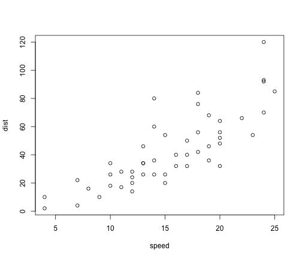

Trade off between max eigen of bipartite matrix and norm of inverse of bipartite matrix.
========================================================

```r
# Nestedness optimization
RewireLinks <- function(B, HowManyToTry) {
    library(bipartite)
    B = sortweb(B)  # sort rows and cols descending
    count1 <- 0
    NumP <- dim(B)[1]
    NumA <- dim(B)[2]
    while (count1 < HowManyToTry) {
        count1 <- count1 + 1
        ## pick one interaction between two random species
        repeat {
            row1 <- sample(1:NumP, 1)
            col1 <- sample(1:NumA, 1)
            if (B[row1, col1] != 0) 
                break
        }
        ## random choose another species
        if (runif(1) < 0.5) {
            row2 = sample(1:row1, 1)
            if (row2 < row1 && B[row2, col1] == 0) {
                B[row2, col1] = B[row1, col1]
                B[row1, col1] = 0
            }
        } else {
            col2 = sample(1:col1, 1)
            if (col2 < col1 && B[row1, col2] == 0) {
                B[row1, col2] = B[row1, col1]
                B[row1, col1] = 0
            }
        }
        sortweb(B)
    }
    B
}
```


```r
library(igraph)
library(bipartite)
```

```
## Loading required package: vegan
## Loading required package: permute
## Loading required package: lattice
## This is vegan 2.0-10
## Loading required package: sna
## sna: Tools for Social Network Analysis
## Version 2.3-2 created on 2014-01-13.
## copyright (c) 2005, Carter T. Butts, University of California-Irvine
##  For citation information, type citation("sna").
##  Type help(package="sna") to get started.
## 
## 
## Attaching package: 'sna'
## 
## The following objects are masked from 'package:igraph':
## 
##     %c%, betweenness, bonpow, closeness, degree, dyad.census,
##     evcent, hierarchy, is.connected, neighborhood, triad.census
## 
##  This is bipartite 2.04
##  For latest changes see versionlog in  ?"bipartite-package".
##  For citation see: citation("bipartite").
##  Have a nice time plotting and analysing two-mode networks.
```

```r
n1 = 100  # number of plants
n2 = 200  # number of animals
edges = 600  # number of edges
g = bipartite.random.game(n1, n2, type = "gnm", m = edges)
a = get.incidence(g)
# visweb(a)
```


You can also embed plots, for example:


```r
plot(cars)
```

 


